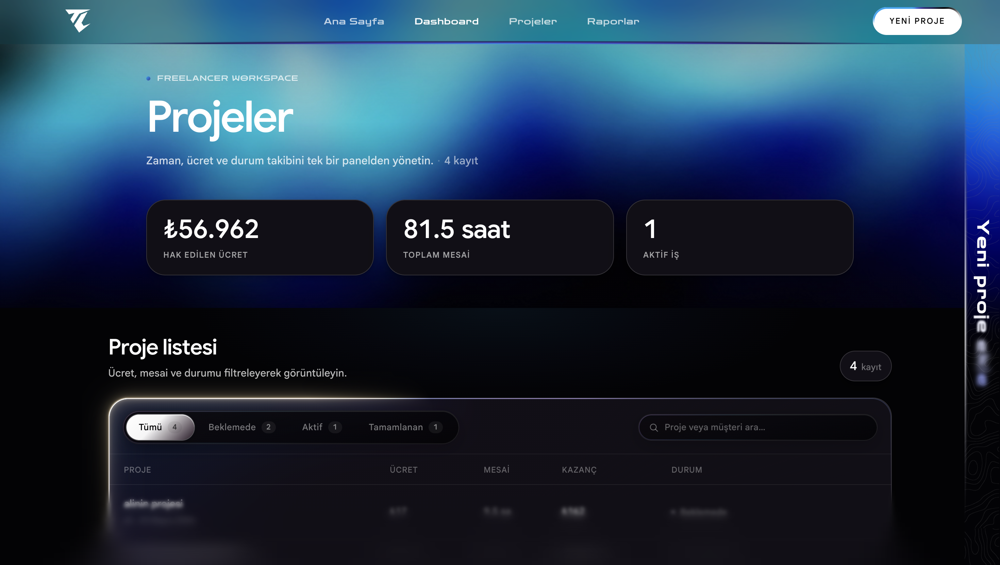

<div align="center">


# TimeCraft

**Freelancer ve bağımsız çalışanlar için zaman, ücret ve proje takibi.**
Tek bir panelde net metrikler, anlık görünürlük ve sade bir dashboard deneyimi.

[](https://react.dev)
[](https://vite.dev)
[](https://tailwindcss.com)
[](https://motion.dev)
[](#lisans)

[**Canlı Demo**](https://timecraftt.netlify.app) · [**Kaynak**](https://github.com/MachineX41/TimeCraft) · [**Issues**](https://github.com/MachineX41/TimeCraft/issues)

</div>

<br />

<p align="center">
  
</p>

---

## İçindekiler

- [Genel Bakış](#genel-bakış)
- [Öne Çıkan Özellikler](#öne-çıkan-özellikler)
- [Teknoloji Yığını](#teknoloji-yığını)
- [Hızlı Başlangıç](#hızlı-başlangıç)
- [Kullanılabilir Komutlar](#kullanılabilir-komutlar)
- [Proje Yapısı](#proje-yapısı)
- [Veri Modeli](#veri-modeli)
- [Mimari ve Tasarım Kararları](#mimari-ve-tasarım-kararları)
- [Responsive ve Erişilebilirlik](#responsive-ve-erişilebilirlik)
- [Dağıtım](#dağıtım)
- [Yol Haritası](#yol-haritası)
- [Katkı](#katkı)
- [Lisans](#lisans)

---

## Genel Bakış

TimeCraft, dağınık tablolar ve not defterleri yerine projelerinizi, çalışılan saatleri ve kazançları **tek bir cam panelde** birleştirir. Tüm veriler tarayıcıda lokal olarak tutulur — backend yok, kayıt yok, sürtünme yok.

- **Ana sayfa** — landing deneyimi: özellikler, akış, SSS ve CTA bölümleri
- **Dashboard** — proje listesi, hızlı metrikler ve kart/tablo görünümleri
- **Proje çekmecesi** — masaüstünde sağdan kayan rail, mobilde bottom sheet

---

## Öne Çıkan Özellikler

| Alan | Açıklama |
|------|----------|
| **Proje yönetimi** | Ekle / düzenle / sil, durum yönetimi (Beklemede · Devam Ediyor · Tamamlandı) |
| **Otomatik metrikler** | Toplam kazanç, çalışılan saat ve aktif iş sayısı canlı hesaplanır |
| **Arama & filtre** | Hızlı arama + segmented control filtre çubuğu (4 sekme) |
| **LocalStorage kalıcılık** | Tüm projeler tarayıcı üzerinde JSON olarak saklanır, doğrulamalı yükleme |
| **Hareketli arayüz** | Motion ile sayfa geçişleri, reveal animasyonları ve interaktif CTA |
| **Premium görsel dil** | Rotating conic-gradient border, glassmorphism navbar, contour-textured drawer |
| **Tam responsive** | 3 breakpoint katmanı (mobile / tablet / desktop), safe-area + touch optimizasyonu |
| **Erişilebilirlik** | Klavye navigasyonu, ARIA etiketleri, `prefers-reduced-motion` desteği |

---

## Teknoloji Yığını

- **[React 19](https://react.dev)** — UI çekirdeği
- **[Vite 8](https://vite.dev)** — geliştirme sunucusu ve build aracı
- **[React Router 7](https://reactrouter.com)** — sayfa yönlendirme
- **[Tailwind CSS 4](https://tailwindcss.com)** — utility-first stil katmanı
- **[Motion (Framer Motion)](https://motion.dev)** — animasyon motoru
- **[tsParticles](https://particles.js.org)** — hero sparkles efekti
- **ESLint 10** — kod kalitesi

> Yerel asetler: `Google Sans` (variable font, GRAD/opsz/wght), `Zen Dots` ve TimeCraft özel `countours.svg` topografik dokusu.

---

## Hızlı Başlangıç

### Gereksinimler

- **Node.js 18.18+** veya **20+**
- **npm 10+** (veya pnpm / yarn / bun)

### Kurulum

```bash
# repo'yu klonlayın
git clone https://github.com/MachineX41/TimeCraft.git
cd TimeCraft

# bağımlılıkları yükleyin
npm install

# geliştirme sunucusunu başlatın (http://localhost:5173)
npm run dev
```

### Üretim için derleme

```bash
npm run build      # dist/ klasörüne üretir
npm run preview    # üretim build'ini lokal önizleme
```

---

## Kullanılabilir Komutlar

| Komut | Açıklama |
|-------|----------|
| `npm run dev` | Vite geliştirme sunucusunu HMR ile başlatır |
| `npm run build` | Üretim için optimize edilmiş build üretir (`dist/`) |
| `npm run preview` | Üretim build'ini lokal preview sunucusunda çalıştırır |
| `npm run lint` | ESLint ile tüm `.js/.jsx` dosyalarını kontrol eder |

---

## Proje Yapısı

```
timecraft/
├─ public/                       # statik asetler (font, görsel, ikon)
│  ├─ fonts/                     # Google Sans variable font
│  ├─ timecraftlogo.svg          # marka logosu (favicon olarak da kullanılır)
│  ├─ header.png, headerr.png    # dashboard/hero arka plan görselleri
│  ├─ footer.png                 # footer için blurlu zemin
│  └─ countours.svg              # drawer için topografik doku
│
├─ src/
│  ├─ App.jsx                    # router + route'lar arası geçiş animasyonu
│  ├─ main.jsx                   # giriş noktası
│  ├─ index.css                  # ana stil dosyası (Tailwind + özel BEM)
│  │
│  ├─ pages/
│  │  ├─ Home.jsx                # landing — Hero / Metrics / About / Features / FAQ / CTA
│  │  └─ Dashboard.jsx           # çalışma alanı — projeler + drawer
│  │
│  ├─ components/
│  │  ├─ Navbar.jsx              # sticky glass navbar + hover mega menü
│  │  ├─ Footer.jsx              # blurlu görsel zeminli footer
│  │  ├─ PageHero.jsx            # dashboard üst banner
│  │  ├─ MetricsRow.jsx          # toplam kazanç / saat / aktif iş kartları
│  │  ├─ ProjectTable.jsx        # tablo (desktop) + kart (mobil) görünümü
│  │  ├─ ProjectDrawer.jsx       # detay / düzenle / oluştur paneli (portal)
│  │  ├─ WorkspaceFilterBar.jsx  # segmented control filtre + arama
│  │  ├─ DeleteConfirmModal.jsx  # silme onayı modal'ı
│  │  ├─ PageTransition.jsx      # route'lar arası fade animasyonu
│  │  ├─ BorderGlow.jsx          # canvas tabanlı premium border efekti
│  │  ├─ GradualBlur.jsx         # alt kademeli blur overlay
│  │  ├─ home/                   # landing bölüm componentleri
│  │  └─ ui/                     # küçük UI parçaları (CtaButton, Sparkles, RevealMotion, ColourfulText)
│  │
│  ├─ interfaces/
│  │  └─ projectSchema.js        # tipler, statüler, mock veri, storage anahtarı
│  │
│  ├─ utils/
│  │  ├─ projectStorage.js       # localStorage okuma/yazma + doğrulama
│  │  ├─ projectStats.js         # KPI hesapları + para formatı (TRY)
│  │  ├─ projectSearch.js        # arama fonksiyonu + placeholder metinleri
│  │  └─ ctaButton.js            # CTA hover/animasyon yardımcısı
│  │
│  └─ constants/
│     └─ workspaceBorderGlow.js  # BorderGlow ön ayarları
│
├─ index.html                    # tema rengi + font preload
├─ vite.config.js                # React + Tailwind v4 plugin'leri
├─ netlify.toml                  # Netlify build + SPA redirect
└─ eslint.config.js              # ESLint flat config
```

---

## Veri Modeli

Tüm projeler `localStorage` içinde `timecraft-projects` anahtarı altında JSON olarak saklanır. Sıfır kayıt durumunda mock projeler yüklenir.

```jsonc
{
  "id": "proj-001",
  "clientName": "Nova Digital",
  "projectTitle": "E-ticaret Arayüz Tasarımı",
  "hourlyRate": 850,
  "hoursWorked": 24,
  "status": "Devam Ediyor",
  "about": "E-ticaret vitrininin yeniden tasarımı…",
  "createdAt": "2026-04-12T09:00:00.000Z"
}
```

**Durumlar** — `Beklemede` · `Devam Ediyor` · `Tamamlandı`
**Kazanç** — `hourlyRate × hoursWorked` (TRY, Intl.NumberFormat ile biçimlenir)

> Veri şeması ve yardımcılar: [`src/interfaces/projectSchema.js`](src/interfaces/projectSchema.js) ve [`src/utils/projectStorage.js`](src/utils/projectStorage.js)

---

## Mimari ve Tasarım Kararları

### Routing & Sayfa Geçişleri

`react-router-dom` v7 ile tek `<BrowserRouter>` altında iki route. `PageTransition` componenti, `AnimatePresence mode="wait"` ile sayfalar arası **opacity fade** sağlar. Geçişte scroll en üste alınır.

### State Yönetimi

Global state kütüphanesi yok — `App.jsx` içindeki üst seviye state, prop drilling ile `Dashboard`'a iner. `useCallback` ile referans stabilitesi korunur, `useEffect` yan etkileri minimumdur.

### Drawer (Proje Paneli)

`createPortal` ile `document.body`'ye render edilir. Masaüstünde sağdan kayan **CS:GO 2 tarzı dar rail + hover/açık genişleme** paterni; mobilde tam ekran **bottom sheet** (88dvh, drag handle, safe-area aware).

### Animasyon Stratejisi

- **Sayfa girişi:** `RevealMotion` yardımcıları (`revealBlock`, `revealLine`, `revealList`) — `cubic-bezier(0.22, 1, 0.36, 1)` ease
- **CTA butonu:** `conic-gradient` rotating border (4s linear) + hover'da `cta-fill` animasyonu (1.05s spring-easing)
- **Filtre pill:** `motion.span` `layoutId` ile spring transition
- **Tüm animasyonlar** `prefers-reduced-motion` ile devre dışı bırakılır

### Stil Stratejisi

Tailwind v4 utility'leri + özel BEM sınıfları hybrid yaklaşım. Renk paleti `--color-rim-1..5` CSS custom property'leri ile yönetilir. Glassmorphism (`backdrop-filter: blur + saturate`) ve `@supports` fallback'leri mevcuttur.

---

## Responsive ve Erişilebilirlik

### Breakpoint Katmanları

| Genişlik | Hedef | Davranış |
|----------|-------|----------|
| `≤ 767px` | Telefon | Compact navbar (3.5rem), bottom sheet drawer, kart layout, segmented filter |
| `768–1023px` | Tablet | Mega menü açık, navbar nefes alır, drawer rail aktif |
| `≥ 1024px` | Masaüstü | Tam tablo, geniş hero, mega menü hover |

### Erişilebilirlik

- Semantic HTML (`<header>`, `<nav>`, `<main>`, `<dialog>`, `<aside>`)
- Tüm interaktif elementlerde `aria-*` etiketleri ve klavye desteği
- Focus halkaları (`outline: 2px solid rgb(0 166 244 / 0.55)`)
- `prefers-reduced-motion` ile animasyon kapatma
- Min 44px dokunma alanı (Apple HIG)
- iOS zoom önleyici input `font-size: 1rem`
- `env(safe-area-inset-bottom)` ile notch/home indicator desteği

---

## Dağıtım

### Netlify (önerilen)

1. [Netlify](https://www.netlify.com) → **Add new site** → **Import an existing project**
2. GitHub repo: `MachineX41/TimeCraft`
3. Build ayarları `netlify.toml` içinden otomatik okunur:
   - **Build command:** `npm run build`
   - **Publish directory:** `dist`
4. Deploy

React Router için SPA yönlendirmesi `netlify.toml` içinde tanımlı (`/*` → `/index.html`, 200).

### Manuel statik hosting

```bash
npm run build
# dist/ klasörünü Netlify Drop, Cloudflare Pages, GitHub Pages, S3 vb. yükleyin.
# SPA fallback: /* → /index.html (200)
```

---

## Yol Haritası

- [ ] Çoklu kullanıcı / bulut senkronizasyonu (opsiyonel auth)
- [ ] Aylık / haftalık rapor görünümü ve PDF export
- [ ] Fatura taslakları + müşteriye gönderme
- [ ] Zaman takibi (start/stop timer) entegrasyonu
- [ ] i18n — İngilizce dil desteği
- [ ] Açık tema seçeneği

---

## Katkı

Pull request'ler ve issue'lar memnuniyetle karşılanır. Büyük değişiklikler için önce bir issue açarak ne yapmak istediğinizi tartışmanız önerilir.

```bash
# yeni bir feature branch açın
git checkout -b feat/yeni-ozellik

# kod stili
npm run lint

# commit + push + PR
git commit -m "feat: yeni özellik açıklaması"
git push origin feat/yeni-ozellik
```

---

## Lisans

Bu proje [MIT lisansı](LICENSE) altında dağıtılmaktadır.

---

<div align="center">

**TimeCraft** — Made with care for freelancers.

</div>
